# Introduction to Python

Career Foundry's Python for Web Developers Introduction to Python course.

## Table of Contents

[Exercise 1: Getting Started with Python](#getting-started-with-python)

[Exercise 2: Data Types in Python](#data-types-in-python)

[Exercise 3: Operators and Functions in Python](#operators-and-functions-in-python)

[Exercise 4: File Handling in Python](#file-handling-in-python)

# Getting Started with Python

## Table of Contents

[Install Python](#install-python)

[Set up a virtual environment](#set-up-a-virtual-environment)

[Install Visual Studio Code](#install-visual-studio-code)

[Set up an IPython shell](#set-up-an-ipython-shell)

[Export a requirements file](#export-a-requirements-file)

---

## Install Python

Install [Python 3.8.7](https://www.python.org/downloads/release/python-387/) on your system if you haven’t already. Make sure that you’re able to access the correct Python installation from your terminal and check that it’s running the correct version by using the python --version command.

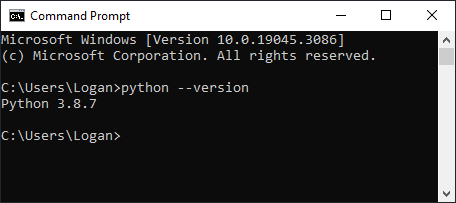

---

## Set up a virtual environment

Set up a new virtual environment and name it “cf-python-base”.


---

## Install Visual Studio Code

Install [Visual Studio Code](https://code.visualstudio.com/download) or another text editor of your choice and make a script called “add.py” that adds two numbers that the user enters.

- Input from a user can be stored into a variable with the following syntax (don’t include < and > in your code): variable_name = int(input("<any prompt you'd like to give to the user>")).
- Store two values a and b from the user and add them to a variable c.
- Finally, print the value of c to the screen. The print() function can be used to print variable values with the following syntax: print(<variable name>).

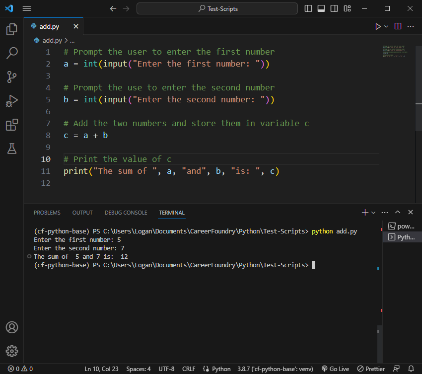

```python
# Prompt the user to enter the first number
a = int(input("Enter the first number: "))

# Prompt the use to enter the second number
b = int(input("Enter the second number: "))

# Add the two numbers and store them in variable c
c = a + b

# Print the value of c
print("The sum of ", a, "and", b, "is: ", c)

```

---

## Set up an IPython shell

Set up an IPython shell in the virtual environment “cf-python-base”. An IPython shell is similar to the regular Python REPL that you saw earlier but with additional features such as syntax highlighting, auto-indentation and robust auto-complete features. The name of the package to be installed is “ipython,” which is available for install via pip. Verify your installation by launching an IPython shell with the command ipython.


---

## Export a requirements file

The requirements file is a text file that lists package requirements for any particular Python application. For example, it can specify that bcrypt 3.2.0 and ipython 7.20.0 need to be installed in order for your Python scripts to run. The requirements file also helps when you’d like to run your Python script on another system. Simply provide your scripts and the “requirements.txt” file, and pip can then automatically install the required packages in another environment by simply referring to your requirements file. Your script can then run in that environment without any unexpected errors.

- First, generate a “requirements.txt” file from your source environment. To do this, you use the pip freeze command and all packages (including version numbers) installed in the currently activated environment will be compiled: > pip freeze > requirements.txt.
- Next, create a new environment called “cf-python-copy”. In this new environment, install packages from the “requirements.txt” file that you generated earlier. To install the packages from this file in any other environment, you run the pip install command with the extra -r argument, followed by the name of your requirements file: > pip install -r requirements.txt.

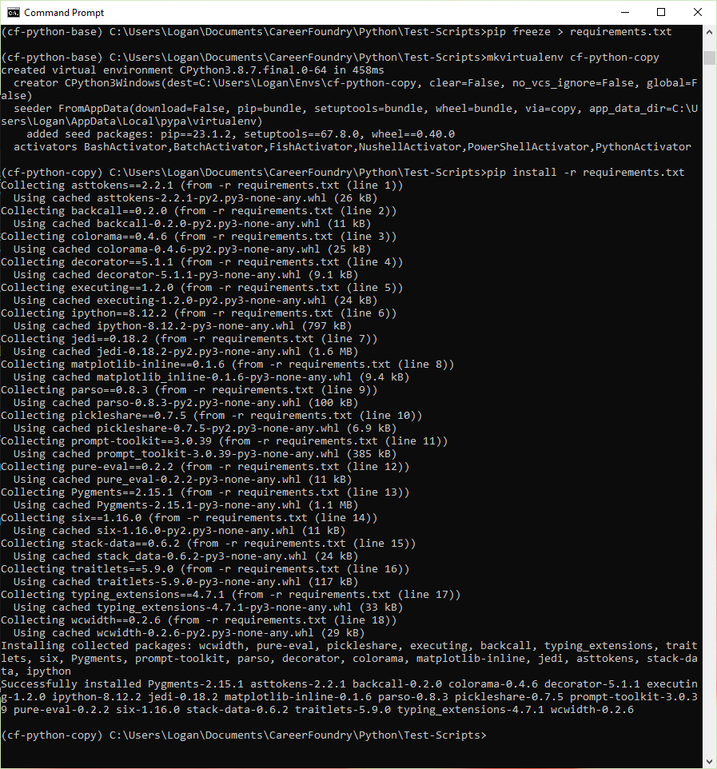

---

# Data Types in Python

## Table of Contents

[Create a Structure](#create-a-structure)

[First Recipe](#first-recipe)

[Create an Outer Structure](#create-an-outer-structure)

[Generate More Recipes](#generate-more-recipes)

[Print the Ingredients](#print-the-ingredients)

---

## Create a structure

Create a structure named recipe_1 that contains the following keys:

- name (str): Contains the name of the recipe
- cooking_time (int): Contains the cooking time in minutes
- ingredients (list): Contains a number of ingredients, each of the str data type

Decide what data structure you would use for this purpose, and in your README file in the repository for this task, describe in approx. 50-75 words why you’ve chosen to use it.

I would use the dictionary data type for creating a recipe because you can associate the keys name, cooking_time, ingredients, each with a different data type and the key names indicate what the values are meant to represent. When using the dictionary data structure the code will be more descriptive. For example if we used a list we would have recipe_1[0] to access the name instead of recipe_1['name']. It is much easier to understand what is going on in the code when using a dictionary.

## First Recipe

The recipe_1 structure that you create will be for a cup of tea, with the following attributes:

- Name: Tea
- Cooking time: 5 minutes
- Ingredients: Tea leaves, Sugar, Water

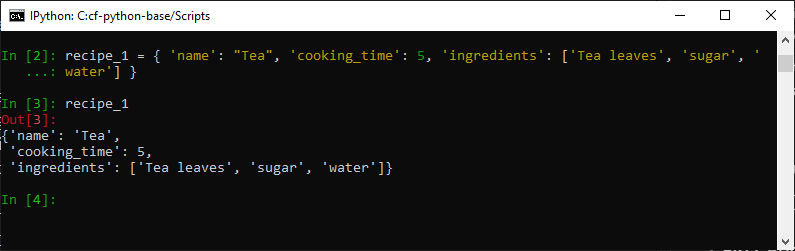

## Create an Outer Structure

Create an outer structure called all_recipes, and then add recipe_1 to it. Figure out what type of structure you would consider for all_recipes, and briefly note down your justification in the README file. Ideally, this outer structure should be sequential in nature, where multiple recipes can be stored and modified as required.

For the outer structure all_recipes I will use a list because it is sequential in nature and I can easily add, remove, and modify items as needed.

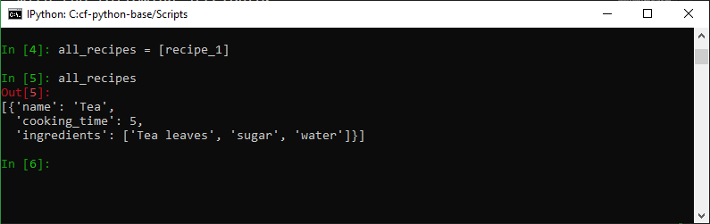

## Generate More Recipes

You can make your own recipes too! Generate 4 more recipes as recipe_2, recipe_3, recipe_4, and recipe_5, and then add them as well to all_recipes.

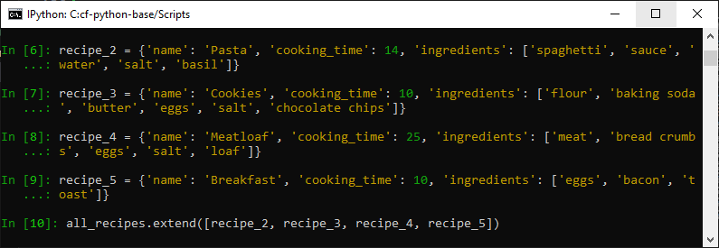

## Print the Ingredients

Once you’re done setting up all_recipes, print the ingredients of each recipe as five different lists, inside the IPython shell.

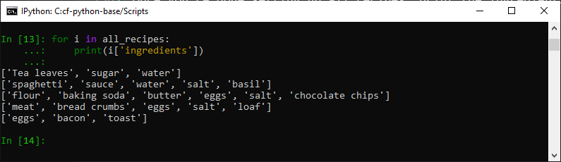

# Operators and Functions in Python

## Table of Contents

[Open a Python Script](#open-a-python-script)

[Initialize Two Empty Lists](#initialize-two-empty-lists)

[Define a Function](#define-a-function)

[How Many Recipes?](#how-many-recipes)

[Take Recipe N Times](#take-recipe-n-times)

[Iterate Through Recipe List](#iterate-through-recipe-list)

[Display All the Ingredients](#display-all-the-ingredients)

---

## Open a Python Script

Open a Python script in an editor of your choice and name it “Exercise_1.3.py”.
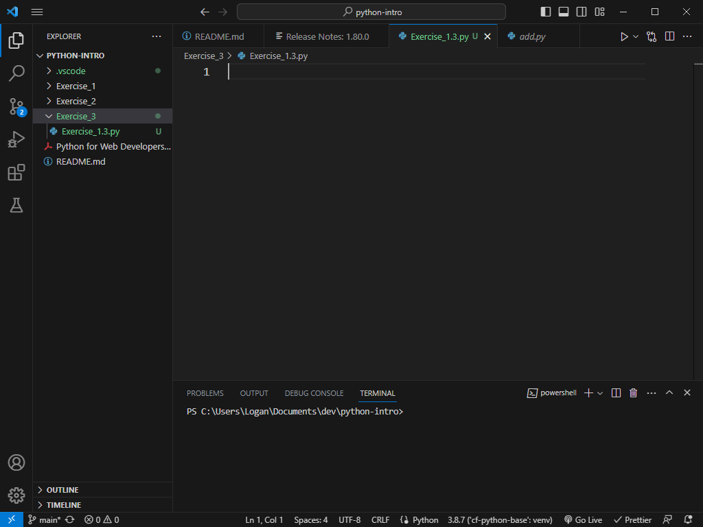

## Initialize Two Empty Lists

Initialize two empty lists: recipes_list and ingredients_list.


## Define a Function

Define a function called take_recipe, which takes input from the user for the following variables:

- name (str): Stores the name of the recipe.
- cooking_time (int): Stores the cooking time (in minutes).
- ingredients (list): A list that stores ingredients, each of the string data type.
- recipe (dictionary): Stores the name, cooking_time, and ingredients variables (e.g., recipe = {'name': name, 'cooking_time': cooking_time, 'ingredients': ingredients}).


## How Many Recipes?

In the main section of your code, ask the user how many recipes they would like to enter. Their response will be linked to a variable n.

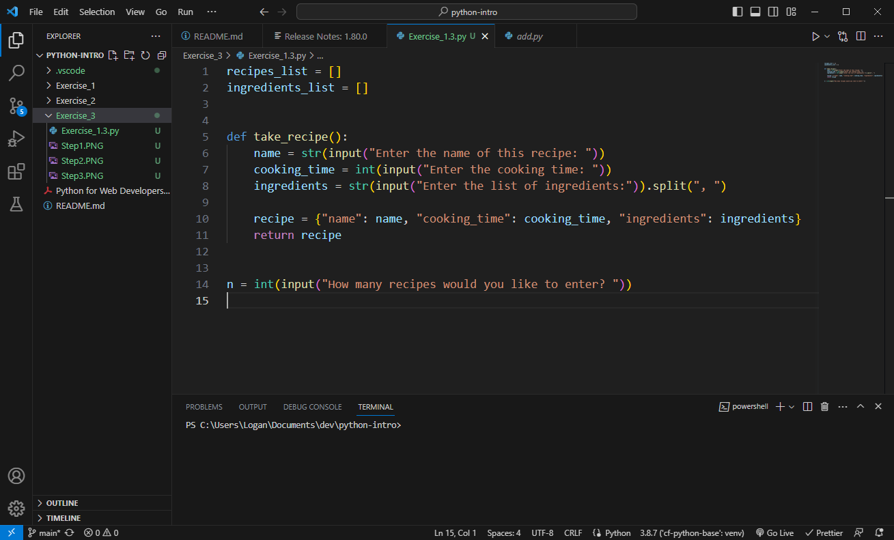

## Take Recipe N Times

Run a for loop, which runs n times to perform the following steps:

- Run take_recipe() and store its return output (a dictionary) in a variable called recipe.
- Run another for loop inside this loop, which iterates through recipe’s ingredients list, where it picks out elements one-by-one as ingredient. It will run the following step inside: if the chosen ingredient isn’t present in ingredients_list, add it to this list. To check if an element ele is present in a sequence seq, you can use the in keyword in a conditional statement as follows: if ele in seq:. Either True or False is returned (remember that you’re checking if ingredient is not in the list, so use the not operator accordingly).
- Once you’ve finished adding ingredients, append recipe to recipes_list.

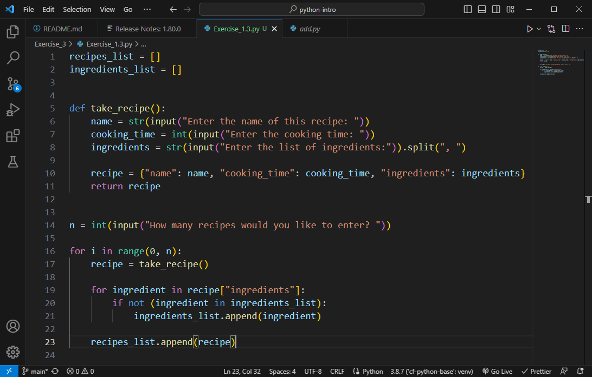

## Iterate Through Recipe List

Run another for loop that iterates through recipes_list, picks out each element (a dictionary) as recipe, and performs the following steps:

- Determine the difficulty of the recipe using the following logic:
  - If cooking_time is less than 10 minutes, and the number of ingredients is less than 4, set a variable called difficulty to the value of Easy.
  - If cooking_time is less than 10 minutes, and the number of ingredients is greater than or equal to 4, set a variable called difficulty to the value of Medium.
  - If cooking_time is greater than or equal to 10 minutes, and the number of ingredients is less than 4, set a variable called difficulty to the value of Intermediate.
  - If cooking_time is greater than or equal to 10 minutes, and the number of ingredients is greater than or equal to 4, set a variable called difficulty to the value of Hard.


## Display All the Ingredients

Next, you’ll have to display all the ingredients that you’ve come across so far in all of the recipes that you’ve just entered. In Step 5 you appended these ingredients into ingredient_list. Now it’s time to print them all out. Print them in alphabetical order, in a format similar to this example:

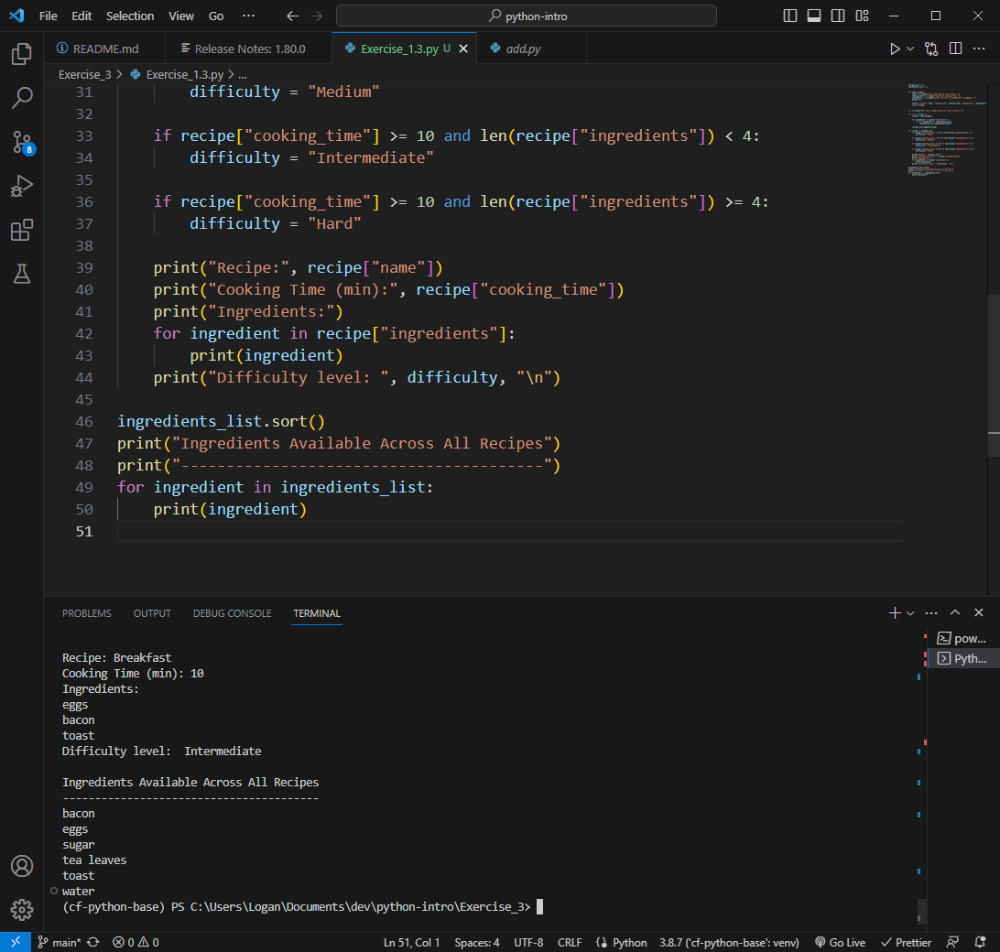

# File Handling in Python

## Table of Contents

[Part 1: recipe_input.py Script](#part-1)

[Part 2: recipe_search.py Script](#part-2)

[Part 3: Final Steps](#part-3)

---

## Part 1

1. Import the pickle module so you can work with binary files.

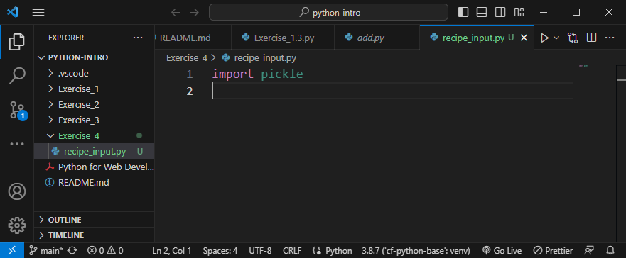 2. Define a function called take_recipe() to take recipes from the user, which performs the following operations:

- Taking in the recipe name, cooking time, and ingredients from the user.
- Calculating the difficulty of the recipe by calling thecalc_difficulty() function.
- Gathering all these attributes into a dictionary and returning it.

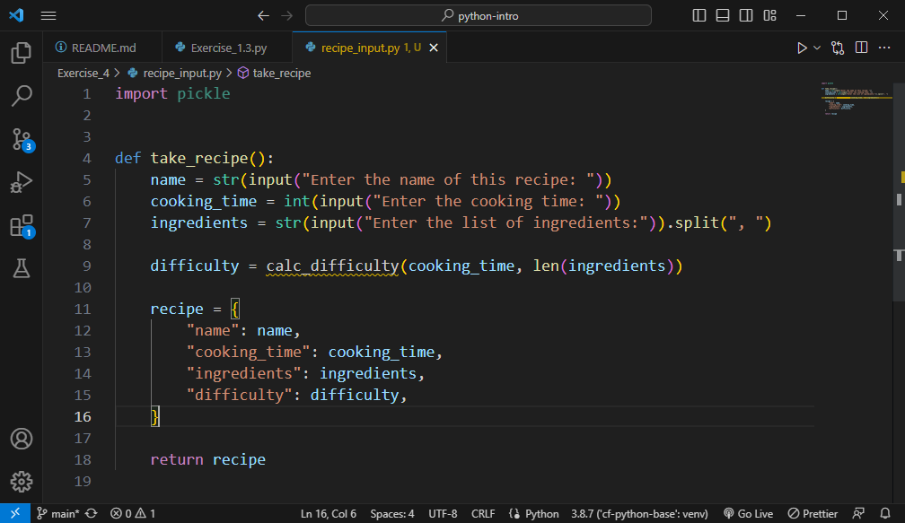

3. Define the function calc_diffficulty(), where the difficulty is returned as Easy, Medium, Intermediate or Hard based on the following logic:
   - If cooking_time is less than 10 minutes and the number of ingredients is less than 4, set a variable called difficulty to the value of Easy.
   - If cooking_time is less than 10 minutes and the number of ingredients is greater than or equal to 4, set a variable called difficulty to Medium.
   - If cooking_time is greater than or equal to 10 minutes and the number of ingredients is less than 4, set a variable called difficulty to the value of Intermediate.
   - If cooking_time is greater than or equal to 10 minutes and the number of ingredients is greater than or equal to 4, set a variable called difficulty to Hard.

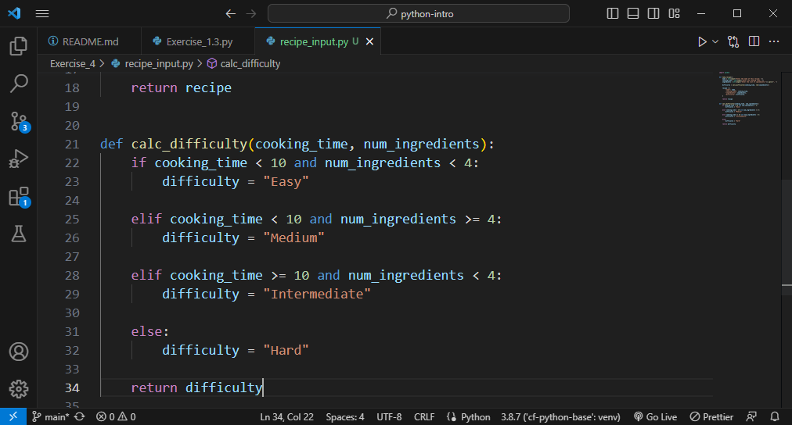

4. Next, you’ll work on the main code. Have the user enter a filename, which would attempt to open a binary file in read mode. Define a try-except-else-finally block as follows:
   - The try block will open the given file, and load its contents through the pickle module into a variable called data. The incoming data is expected to be a dictionary containing two key-value pairs:
     - recipes_list (a list of all recipes)
     - all_ingredients (a list of all ingredients across all recipes)
   - An except clause handles the FileNotFoundError exception if a file with the given name isn’t found. The code block after will create a new dictionary called data, which contains the recipes list under the key recipes_list and another list containing all the ingredients under all_ingredients.
   - Another except clause that handles other exceptions and performs the same operations as the first except block.
   - An else block that closes the file stream that would’ve been opened in the try block.
   - A finally block that extracts the values from the dictionary into two separate lists: recipes_list and all_ingredients.

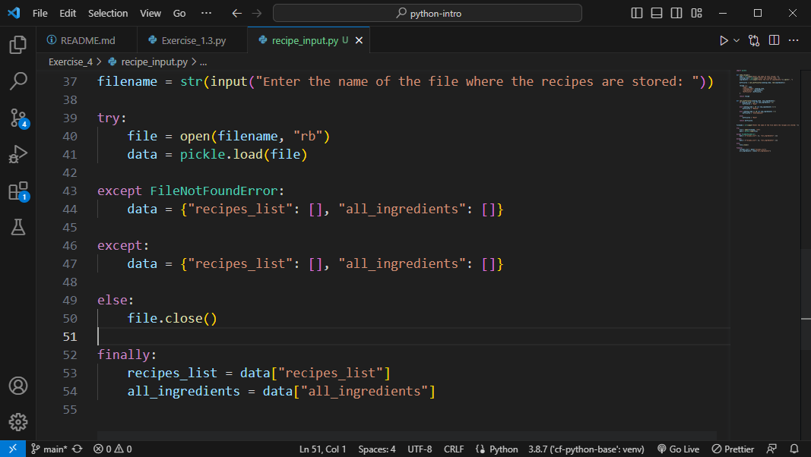

5. Ask the user how many recipes they’d like to enter, and define a for loop that calls the take_recipe() function. You can append the output of this function into recipes_list. Next, define an inner loop that scans through the recipe’s ingredients and adds them to all_ingredients if they’re not already there.

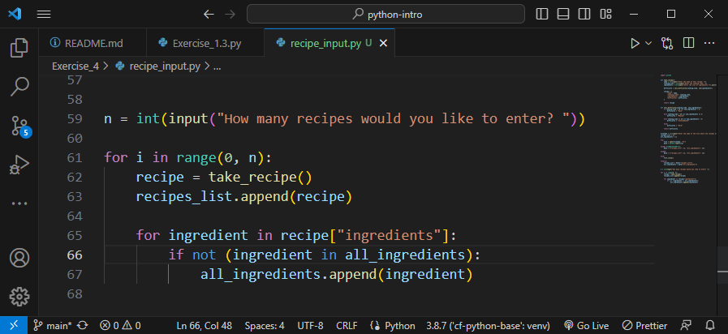

6. Gather the updated recipes_list and all_ingredients into the dictionary called data.

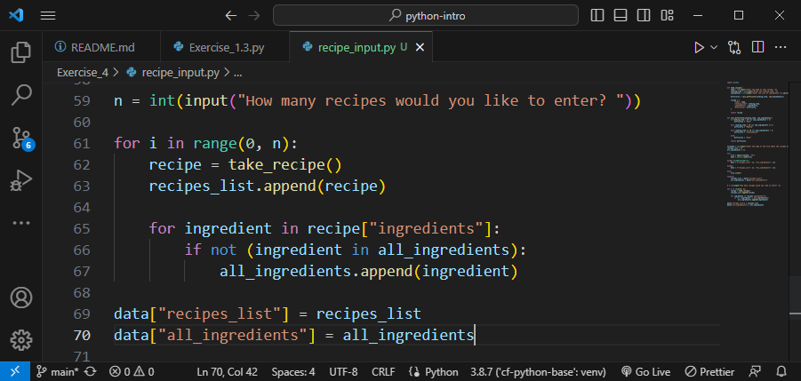

7. Finally, open a binary file with the user-defined filename and write data to it using the pickle module.

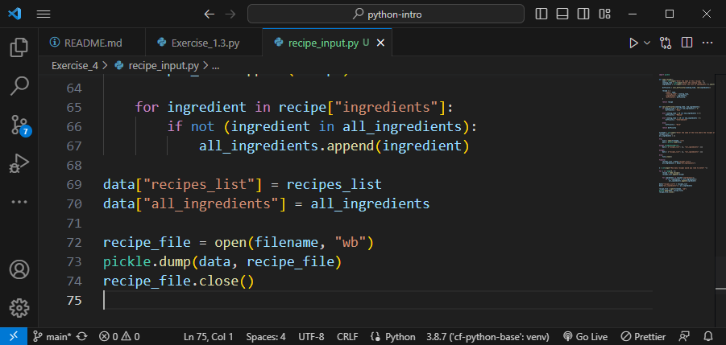

## Part 2

1. Import the pickle module.

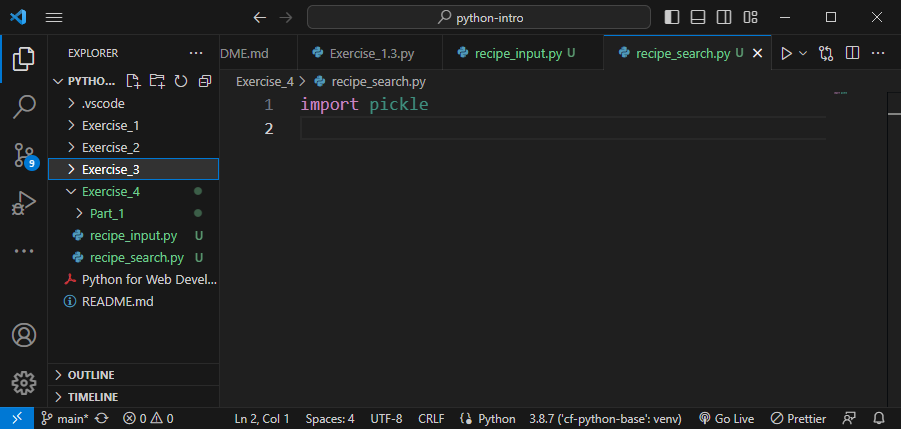

2. Define a function to display a recipe called display_recipe(), which takes in one recipe (of the dictionary type) as an argument and prints all of its attributes including the recipe name, cooking time, ingredients, and difficulty.

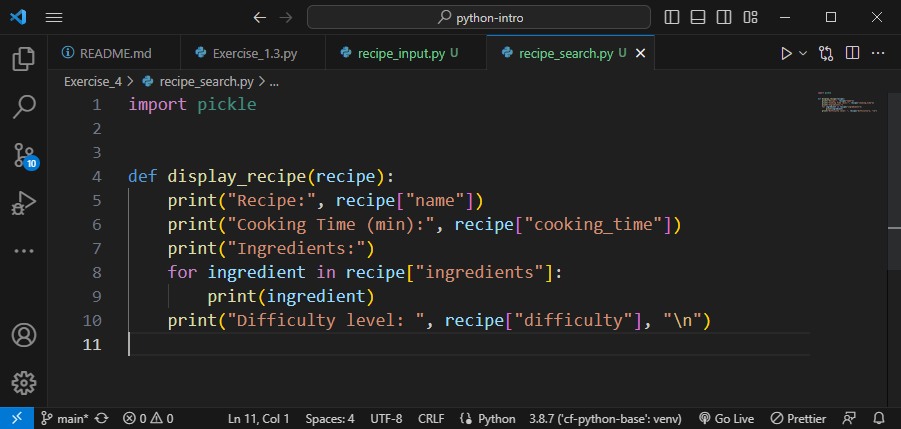

3. Define another function called search_ingredient() to search for an ingredient in the given data. The function takes in a dictionary called data as its argument. The function will perform the following steps:
   - First, it shows the user all the available ingredients contained in data, under the key all_ingredients. Each ingredient is displayed with a number (take the index of each ingredient for this purpose using the enumerate() function).
   - Define a try block where the user gets to pick a number from this list. This number is used as the index to retrieve the corresponding ingredient, which is then stored into a variable called ingredient_searched.
   - Make an except clause that warns the user if the input is incorrect.
   - Add an else clause that goes through every recipe in data (hint: recipes_list is the key that holds every recipe). Each recipe that contains the given ingredient will be printed.

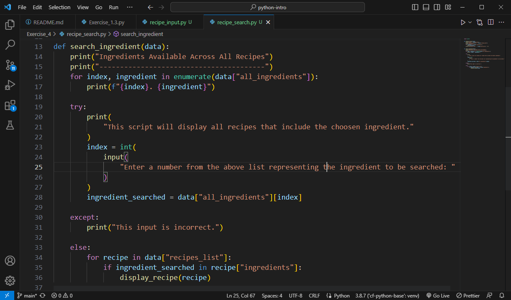

4. In the main code, ask the user for the name of the file that contains your recipe data.

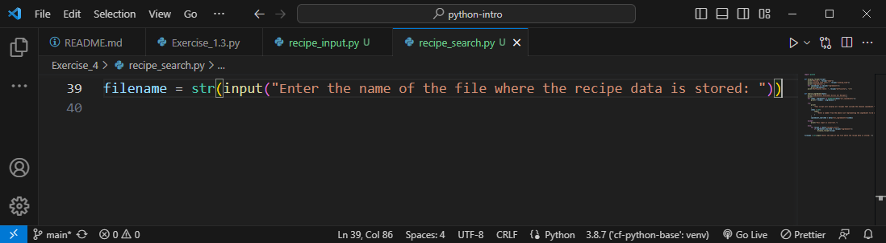

5. Use a try block to open the file, and then extract its contents into data (from Step 3) using the pickle module.

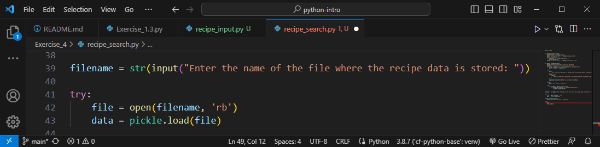

6. For when the try block fails, add an except block to warn the user that the file hasn’t been found.

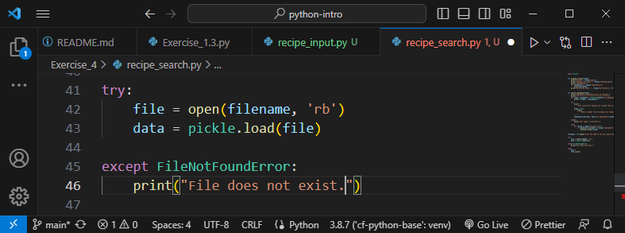

7. Define an else block that calls search_ingredient() while passing data into it as an argument.

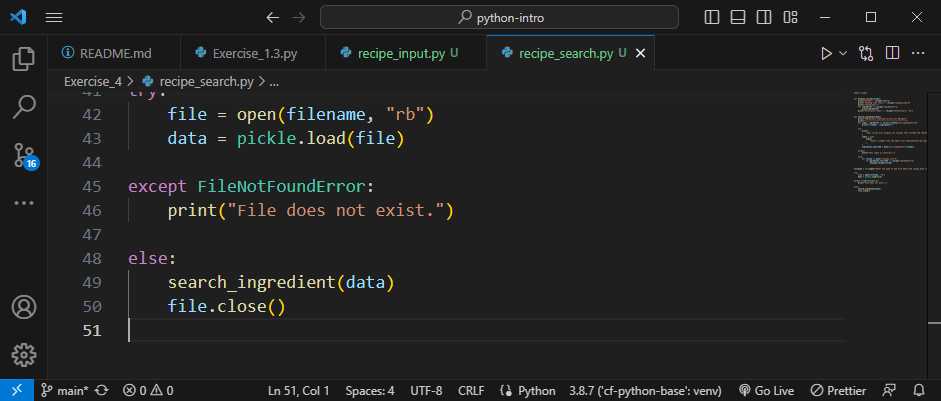

## Part 3

1. Run “recipe_input.py” and enter a few sample recipes of your choice. Make sure the script can generate a binary file after execution. Take screenshots of your terminal while executing the script.

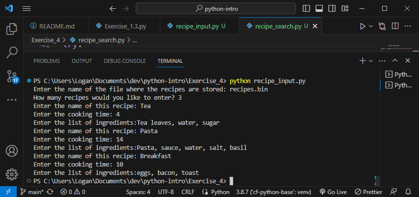

2. Run “recipe_search.py”, enter the ingredient to be searched for, and make sure you get the desired output with the relevant recipes. Take more screenshots of the script while executing.

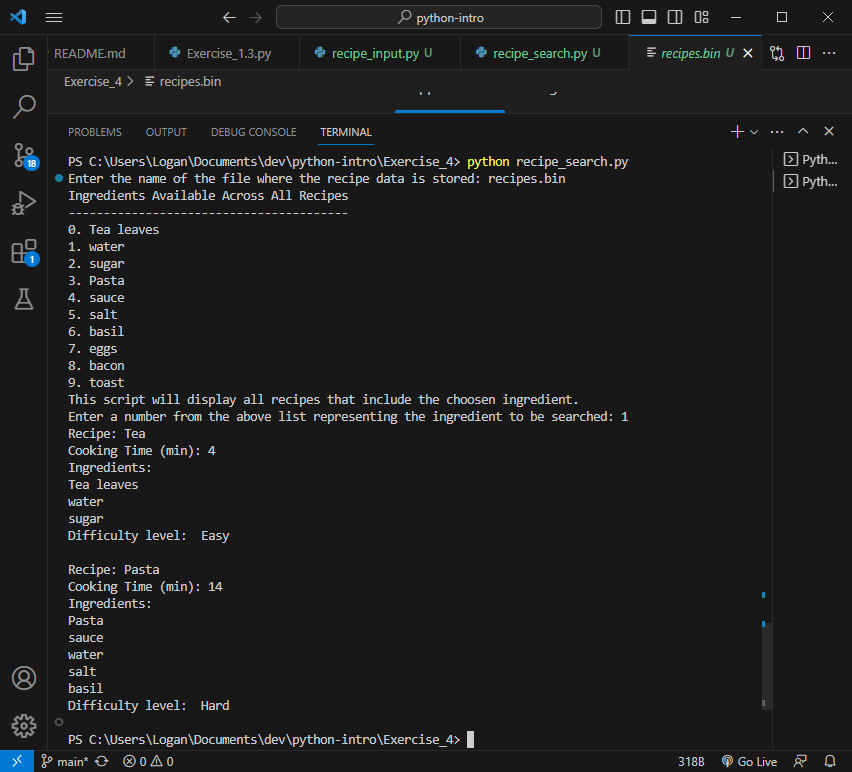
