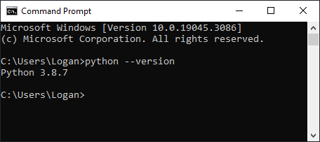

# Introduction to Python
Career Foundry's Python for Web Developers Introduction to Python course.

## Table of Contents
[Exercise 1: Getting Started with Python](#getting-started-with-python)

## Getting Started with Python
### Table of Contents
[Step 1: Install Python](#step-1)
### Step 1
Install Python 3.8.7 on your system if you haven’t already. Make sure that you’re able to access the correct Python installation from your terminal and check that it’s running the correct version by using the python --version command.

