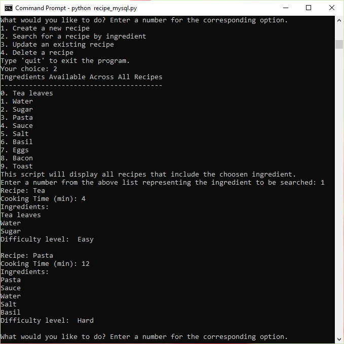

# Introduction to Python

Career Foundry's Python for Web Developers Introduction to Python course.

## Table of Contents

[Exercise 1: Getting Started with Python](#getting-started-with-python)

[Exercise 2: Data Types in Python](#data-types-in-python)

[Exercise 3: Operators and Functions in Python](#operators-and-functions-in-python)

[Exercise 4: File Handling in Python](#file-handling-in-python)

[Exercise 5: Object-Oriented Programming in Python](#object-oriented-programming-in-python)

[Exercise 6: Databases in Python](#databases-in-python)

[Exercise 7: Object-Relational Mapping in Python](#object-relational-mapping-in-python)

# Getting Started with Python

## Table of Contents

[Install Python](#install-python)

[Set up a virtual environment](#set-up-a-virtual-environment)

[Install Visual Studio Code](#install-visual-studio-code)

[Set up an IPython shell](#set-up-an-ipython-shell)

[Export a requirements file](#export-a-requirements-file)

---

## Install Python

Install [Python 3.8.7](https://www.python.org/downloads/release/python-387/) on your system if you haven’t already. Make sure that you’re able to access the correct Python installation from your terminal and check that it’s running the correct version by using the python --version command.


---

## Set up a virtual environment

Set up a new virtual environment and name it “cf-python-base”.


---

## Install Visual Studio Code

Install [Visual Studio Code](https://code.visualstudio.com/download) or another text editor of your choice and make a script called “add.py” that adds two numbers that the user enters.

- Input from a user can be stored into a variable with the following syntax (don’t include < and > in your code): variable_name = int(input("<any prompt you'd like to give to the user>")).
- Store two values a and b from the user and add them to a variable c.
- Finally, print the value of c to the screen. The print() function can be used to print variable values with the following syntax: print(<variable name>).


```python
# Prompt the user to enter the first number
a = int(input("Enter the first number: "))

# Prompt the use to enter the second number
b = int(input("Enter the second number: "))

# Add the two numbers and store them in variable c
c = a + b

# Print the value of c
print("The sum of ", a, "and", b, "is: ", c)

```

---

## Set up an IPython shell

Set up an IPython shell in the virtual environment “cf-python-base”. An IPython shell is similar to the regular Python REPL that you saw earlier but with additional features such as syntax highlighting, auto-indentation and robust auto-complete features. The name of the package to be installed is “ipython,” which is available for install via pip. Verify your installation by launching an IPython shell with the command ipython.


---

## Export a requirements file

The requirements file is a text file that lists package requirements for any particular Python application. For example, it can specify that bcrypt 3.2.0 and ipython 7.20.0 need to be installed in order for your Python scripts to run. The requirements file also helps when you’d like to run your Python script on another system. Simply provide your scripts and the “requirements.txt” file, and pip can then automatically install the required packages in another environment by simply referring to your requirements file. Your script can then run in that environment without any unexpected errors.

- First, generate a “requirements.txt” file from your source environment. To do this, you use the pip freeze command and all packages (including version numbers) installed in the currently activated environment will be compiled: > pip freeze > requirements.txt.
- Next, create a new environment called “cf-python-copy”. In this new environment, install packages from the “requirements.txt” file that you generated earlier. To install the packages from this file in any other environment, you run the pip install command with the extra -r argument, followed by the name of your requirements file: > pip install -r requirements.txt.


---

# Data Types in Python

## Table of Contents

[Create a Structure](#create-a-structure)

[First Recipe](#first-recipe)

[Create an Outer Structure](#create-an-outer-structure)

[Generate More Recipes](#generate-more-recipes)

[Print the Ingredients](#print-the-ingredients)

---

## Create a structure

Create a structure named recipe_1 that contains the following keys:

- name (str): Contains the name of the recipe
- cooking_time (int): Contains the cooking time in minutes
- ingredients (list): Contains a number of ingredients, each of the str data type

Decide what data structure you would use for this purpose, and in your README file in the repository for this task, describe in approx. 50-75 words why you’ve chosen to use it.

I would use the dictionary data type for creating a recipe because you can associate the keys name, cooking_time, ingredients, each with a different data type and the key names indicate what the values are meant to represent. When using the dictionary data structure the code will be more descriptive. For example if we used a list we would have recipe_1[0] to access the name instead of recipe_1['name']. It is much easier to understand what is going on in the code when using a dictionary.

## First Recipe

The recipe_1 structure that you create will be for a cup of tea, with the following attributes:

- Name: Tea
- Cooking time: 5 minutes
- Ingredients: Tea leaves, Sugar, Water


## Create an Outer Structure

Create an outer structure called all_recipes, and then add recipe_1 to it. Figure out what type of structure you would consider for all_recipes, and briefly note down your justification in the README file. Ideally, this outer structure should be sequential in nature, where multiple recipes can be stored and modified as required.

For the outer structure all_recipes I will use a list because it is sequential in nature and I can easily add, remove, and modify items as needed.


## Generate More Recipes

You can make your own recipes too! Generate 4 more recipes as recipe_2, recipe_3, recipe_4, and recipe_5, and then add them as well to all_recipes.


## Print the Ingredients

Once you’re done setting up all_recipes, print the ingredients of each recipe as five different lists, inside the IPython shell.


# Operators and Functions in Python

## Table of Contents

[Open a Python Script](#open-a-python-script)

[Initialize Two Empty Lists](#initialize-two-empty-lists)

[Define a Function](#define-a-function)

[How Many Recipes?](#how-many-recipes)

[Take Recipe N Times](#take-recipe-n-times)

[Iterate Through Recipe List](#iterate-through-recipe-list)

[Display All the Ingredients](#display-all-the-ingredients)

---

## Open a Python Script

Open a Python script in an editor of your choice and name it “Exercise_1.3.py”.


## Initialize Two Empty Lists

Initialize two empty lists: recipes_list and ingredients_list.


## Define a Function

Define a function called take_recipe, which takes input from the user for the following variables:

- name (str): Stores the name of the recipe.
- cooking_time (int): Stores the cooking time (in minutes).
- ingredients (list): A list that stores ingredients, each of the string data type.
- recipe (dictionary): Stores the name, cooking_time, and ingredients variables (e.g., recipe = {'name': name, 'cooking_time': cooking_time, 'ingredients': ingredients}).


## How Many Recipes?

In the main section of your code, ask the user how many recipes they would like to enter. Their response will be linked to a variable n.


## Take Recipe N Times

Run a for loop, which runs n times to perform the following steps:

- Run take_recipe() and store its return output (a dictionary) in a variable called recipe.
- Run another for loop inside this loop, which iterates through recipe’s ingredients list, where it picks out elements one-by-one as ingredient. It will run the following step inside: if the chosen ingredient isn’t present in ingredients_list, add it to this list. To check if an element ele is present in a sequence seq, you can use the in keyword in a conditional statement as follows: if ele in seq:. Either True or False is returned (remember that you’re checking if ingredient is not in the list, so use the not operator accordingly).
- Once you’ve finished adding ingredients, append recipe to recipes_list.


## Iterate Through Recipe List

Run another for loop that iterates through recipes_list, picks out each element (a dictionary) as recipe, and performs the following steps:

- Determine the difficulty of the recipe using the following logic:
  - If cooking_time is less than 10 minutes, and the number of ingredients is less than 4, set a variable called difficulty to the value of Easy.
  - If cooking_time is less than 10 minutes, and the number of ingredients is greater than or equal to 4, set a variable called difficulty to the value of Medium.
  - If cooking_time is greater than or equal to 10 minutes, and the number of ingredients is less than 4, set a variable called difficulty to the value of Intermediate.
  - If cooking_time is greater than or equal to 10 minutes, and the number of ingredients is greater than or equal to 4, set a variable called difficulty to the value of Hard.


## Display All the Ingredients

Next, you’ll have to display all the ingredients that you’ve come across so far in all of the recipes that you’ve just entered. In Step 5 you appended these ingredients into ingredient_list. Now it’s time to print them all out. Print them in alphabetical order, in a format similar to this example:


# File Handling in Python

## Table of Contents

[Part 1: recipe_input.py Script](#part-1)

[Part 2: recipe_search.py Script](#part-2)

[Part 3: Final Steps](#part-3)

---

## Part 1

1. Import the pickle module so you can work with binary files.

 2. Define a function called take_recipe() to take recipes from the user, which performs the following operations:

- Taking in the recipe name, cooking time, and ingredients from the user.
- Calculating the difficulty of the recipe by calling thecalc_difficulty() function.
- Gathering all these attributes into a dictionary and returning it.


3. Define the function calc_diffficulty(), where the difficulty is returned as Easy, Medium, Intermediate or Hard based on the following logic:
   - If cooking_time is less than 10 minutes and the number of ingredients is less than 4, set a variable called difficulty to the value of Easy.
   - If cooking_time is less than 10 minutes and the number of ingredients is greater than or equal to 4, set a variable called difficulty to Medium.
   - If cooking_time is greater than or equal to 10 minutes and the number of ingredients is less than 4, set a variable called difficulty to the value of Intermediate.
   - If cooking_time is greater than or equal to 10 minutes and the number of ingredients is greater than or equal to 4, set a variable called difficulty to Hard.


4. Next, you’ll work on the main code. Have the user enter a filename, which would attempt to open a binary file in read mode. Define a try-except-else-finally block as follows:
   - The try block will open the given file, and load its contents through the pickle module into a variable called data. The incoming data is expected to be a dictionary containing two key-value pairs:
     - recipes_list (a list of all recipes)
     - all_ingredients (a list of all ingredients across all recipes)
   - An except clause handles the FileNotFoundError exception if a file with the given name isn’t found. The code block after will create a new dictionary called data, which contains the recipes list under the key recipes_list and another list containing all the ingredients under all_ingredients.
   - Another except clause that handles other exceptions and performs the same operations as the first except block.
   - An else block that closes the file stream that would’ve been opened in the try block.
   - A finally block that extracts the values from the dictionary into two separate lists: recipes_list and all_ingredients.


5. Ask the user how many recipes they’d like to enter, and define a for loop that calls the take_recipe() function. You can append the output of this function into recipes_list. Next, define an inner loop that scans through the recipe’s ingredients and adds them to all_ingredients if they’re not already there.


6. Gather the updated recipes_list and all_ingredients into the dictionary called data.


7. Finally, open a binary file with the user-defined filename and write data to it using the pickle module.


## Part 2

1. Import the pickle module.


2. Define a function to display a recipe called display_recipe(), which takes in one recipe (of the dictionary type) as an argument and prints all of its attributes including the recipe name, cooking time, ingredients, and difficulty.


3. Define another function called search_ingredient() to search for an ingredient in the given data. The function takes in a dictionary called data as its argument. The function will perform the following steps:
   - First, it shows the user all the available ingredients contained in data, under the key all_ingredients. Each ingredient is displayed with a number (take the index of each ingredient for this purpose using the enumerate() function).
   - Define a try block where the user gets to pick a number from this list. This number is used as the index to retrieve the corresponding ingredient, which is then stored into a variable called ingredient_searched.
   - Make an except clause that warns the user if the input is incorrect.
   - Add an else clause that goes through every recipe in data (hint: recipes_list is the key that holds every recipe). Each recipe that contains the given ingredient will be printed.


4. In the main code, ask the user for the name of the file that contains your recipe data.


5. Use a try block to open the file, and then extract its contents into data (from Step 3) using the pickle module.


6. For when the try block fails, add an except block to warn the user that the file hasn’t been found.


7. Define an else block that calls search_ingredient() while passing data into it as an argument.


## Part 3

1. Run “recipe_input.py” and enter a few sample recipes of your choice. Make sure the script can generate a binary file after execution. Take screenshots of your terminal while executing the script.


2. Run “recipe_search.py”, enter the ingredient to be searched for, and make sure you get the desired output with the relevant recipes. Take more screenshots of the script while executing.


---

# Object-Oriented Programming in Python

## Table of Contents

[Define a Recipe class](#define-a-recipe-class)

[Define procedural attributes](#define-procedural-attributes)

[Define a method recipe_search](#define-a-method-recipe_search)

[Make a Recipe object](#make-a-recipe-object)

[Make a few more Recipes](#make-a-few-more-recipes)

[Wrap the recipes into a list](#wrap-the-recipes-into-a-list)

[Use the recipe_search method](#use-the-recipe_search-method)

---

## Define a Recipe class

To begin, open a script file named “recipe_oop.py” and perform the following steps.

Define a class Recipe, with the following data attributes:

- name: the name of a recipe
- ingredients: a list containing the ingredients for a recipe
- cooking_time: the time taken in minutes to carry out a recipe
- difficulty: an auto-generated attribute that says whether the recipe is Easy, Medium, Intermediate, or Hard based on the following logic (this attribute will be updated by the upcoming calculate_difficulty() class method):
  - If cooking_time is less than 10 minutes, and the number of ingredients is less than 4, set a variable called difficulty to the value of Easy.
  - If cooking_time is less than 10 minutes, and the number of ingredients is greater than or equal to 4, set a variable called difficulty to the value of Medium.
  - If cooking_time is greater than or equal to 10 minutes, and the number of ingredients is less than 4, set a variable called difficulty to the value of Intermediate.
  - If cooking_time is greater than or equal to 10 minutes, and the number of ingredients is greater than or equal to 4, set a variable called difficulty to the value of Hard.


## Define procedural attributes

Define the following procedural attributes (methods) for the class as well:

- An initialization method that takes in the name for the recipe and initializes the other data attributes too. Getter and setter methods for name and cooking_time.
- A method called add_ingredients that takes in variable-length arguments for the recipe’s ingredients. For example, the arguments could be either ("Salt") or even ("Salt", "Pepper", "Flour", "Water", "Bananas", "Marzipan"); your method should take in these ingredients and add them to ingredients. Once all the ingredients are added, this function calls update_all_ingredients() , which you’ll define shortly.
- A getter method for ingredients that returns the list itself.


- A method called calculate_difficulty() that uses the logic in part 1 of this task, and updates the difficulty of the recipe.
- A getter method for difficulty which also calls calculate_difficulty() if difficulty hasn’t been calculated.
- A search method called search_ingredient() that takes an ingredient as an argument, searches for it in the recipe, and returns True or False appropriately.
- A method called update_all_ingredients() that goes through the current object’s ingredients and adds them to a class variable called all_ingredients, if they’re not already present. This class variable keeps track of all the ingredients that exist across all recipes.
- A string representation that prints the entire recipe over a well formatted string.


## Define a method recipe_search

To find recipes that contain a specific ingredient, define a method called recipe_search():

- Define 2 parameters for this method:
  - data: takes in a list of Recipe objects to search from
  - search_term: the ingredient to be searched for
- Run a for loop that traverses through data, and performs the following steps:
  - Within the object that is in focus, call the search_ingredient method to see if the ingredient is present or not.
  - If the above condition is satisfied, print the recipe.


## Make a Recipe object

In the main code, make an object under the Recipe class:

- Initialize an object named tea under this class, and set the recipe’s name as "Tea" through the initialization step.
- Add the following ingredients to this recipe: Tea Leaves, Sugar, Water.
- Set the cooking time for this recipe as 5 (in minutes).
- Display the string representation of this object.


## Make a few more Recipes

Make a few more recipes with the given attributes, and display their respective string representations as well:

- Coffee:
  - Ingredients: Coffee Powder, Sugar, Water
  - Cooking time: 5 minutes
- Cake:
  - Ingredients: Sugar, Butter, Eggs, Vanilla Essence, Flour, Baking Powder, Milk
  - Cooking time: 50 minutes
- Banana Smoothie:
  - Ingredients: Bananas, Milk, Peanut Butter, Sugar, Ice Cubes
  - Cooking time: 5 minutes


## Wrap the recipes into a list

Wrap the recipes into a list called recipes_list.


## Use the recipe_search method

Use the recipe_search() method to search for recipes that contain each ingredient out of: Water, Sugar, Bananas.


# Databases in Python

## Table of Contents

[Create and Connect Database](#create-and-connect-database)

[The Main Menu](#the-main-menu)

[Creating a Recipe](#creating-a-recipe)

[Searching for a Recipe](#searching-for-a-recipe)

[Updating a Recipe](#updating-a-recipe)

[Deleting a Recipe](#deleting-a-recipe)

[Final Steps](#final-steps)

---

## Create and Connect Database

Before you visualize anything to the user, you should connect your “recipe_mysql.py” script to your MySQL server:

1. First, import the mysql.connector module.
2. Next, initialize a connection object called conn, which connects with the following parameters, based on the user that you set up earlier:

- Hostname is localhost
- Username is cf-python
- Password is password

3. Next, initialize a cursor object from conn.
4. Create a database called task_database. To ensure you don’t get errors from accidentally using multiple databases with the same name, make sure it’s the only database with this name on the server by using the EXISTS statement: CREATE DATABASE IF NOT EXISTS <database name>
5. Have your script access your database with the USE statement.
6. Create a table called Recipes with the following columns:

- id: integer type; increments automatically; the primary key for this table.
- name: string type; character limit of 50; stores the name of the recipe.
- ingredients: string type; character limit of 255; stores the ingredients of the recipe in the form of a string.
- cooking_time: integer type; stores the cooking time in minutes.
- difficulty: string type; character limit of 20; stores the difficulty level as Easy, Medium, Intermediate, or Hard.

As you did with the database, use the EXISTS statement to make sure there isn’t already a table with the same name: CREATE TABLE IF NOT EXISTS <table name>


## The Main Menu

To implement a main menu, let’s first understand how the user would flow through it:

- First, the user gets to choose from four options: adding recipes, searching for recipes, modifying recipes, and deleting recipes. Once the user selects an option, it should be launched through its own function call. When the function is over, the user needs to be taken back to the main menu so they can perform other operations.
- The process of user selection, function calling, and returning to the main menu requires a loop so that after the process has been completed once it can loop and happen again. A while loop would be perfect for this, because in this case you don’t know exactly how many times the loop will run.
- The condition for running the loop can be based on the user’s choice between the 4 options (adding recipes, searching for recipes, etc.). However, if the user were to enter a designated choice to exit the program, the loop would stop.

Therefore, your main_menu() function requires the following options:

1. Creating a new recipe: Calls a function called create_recipe() which accepts conn and cursor as its arguments.
2. Searching for a recipe by ingredient: Calls a function called search_recipe() which accepts conn and cursor as its arguments.
3. Updating an existing recipe: Calls a function called update_recipe() which accepts conn and cursor as its arguments.
4. Deleting a recipe: Calls a function called delete_recipe() which accepts conn and cursor as its arguments.

If the user exits this loop, any changes to the database would be committed and the connection created would be closed.

Once you've defined the main_menu() function, call it in the main code. Pass conn and cursor as arguments so that the code inside the main_menu() function can use the database.


## Creating a Recipe

1. First, collect the following details for a recipe entry:

- name: Name of the recipe, string type.
- cooking_time: Cooking time of the recipe in minutes, integer type.
- ingredients: Ingredients of the recipe, each ingredient stored as a string in this list.

2. Next, call a function called calculate_difficulty(). It calculates the difficulty of the recipe by taking in cooking_time and ingredients as its arguments, and returning one of the following strings: Easy, Medium, Intermediate, or Hard. Store the output in a variable called difficulty. Here’s how you can define this function:

- Set cooking_time and ingredients as the input parameters.
- These parameters will be used to return one of four strings that define the recipe’s difficulty: Easy, Medium, Intermediate, or Hard.
- Follow the logic below using if-elif statements to return the appropriate difficulty:
  - If cooking_time is less than 10 minutes and the number of ingredients is less than 4, set a variable called difficulty to the value of Easy.
  - If cooking_time is less than 10 minutes and the number of ingredients is greater than or equal to 4, set a variable called difficulty to the value of Medium.
  - If cooking_time is greater than or equal to 10 minutes and the number of ingredients is less than 4, set a variable called difficulty to the value of Intermediate.
  - If cooking_time is greater than or equal to 10 minutes and the number of ingredients is greater than or equal to 4, set a variable called difficulty to the value of Hard.
  - Return difficulty once the function’s done.

3. Now, you have to prepare to wrap this information up in an SQL query so that you can enter it into the Recipes table on your database. Since MySQL doesn’t fully support arrays, your ingredients list needs to be converted into a comma-separated string. This can be done through the join() method, which is used with the syntax: <returned_string> = "<separator characters>".join(<sequence from which items are to be joined>). Here, you need to join the elements of the list ingredients, the separator being a comma followed by a space (", "). Finally, build the query string in the following format: INSERT INTO Recipes (name, ingredients, cooking_time, difficulty) VALUES (<respective values for each column>).
4. Execute the query, then commit your changes.


## Searching for a Recipe

1. You need to begin with an entire list of ingredients that is available in the Recipes table for the user to choose from. Obtain this list by SELECT-ing only the ingredients column from your table. Store the output into a variable called results.
2. results is made up of a list of rows, each row being a tuple containing column values. Since you’re only retrieving the ingredients column, each row contains a single-element tuple, the element being a string containing the ingredients for each recipe. Add each ingredient that you come across into a new list called all_ingredients, and make sure that there are no duplicates.
3. Display all the ingredients that you’ve found so far to the user, and allow them to pick a number corresponding to the ingredient in order to begin a search. Store the ingredient to be searched for into a variable called search_ingredient.
4. To search for rows in the table that contain search_ingredient within the ingredients column, use the WHERE statement with the LIKE operator: SELECT columns to be displayed FROM table WHERE search column LIKE search pattern.
   In your case, an ingredient that you search for can either be in the middle, at the beginning, or at the end of the ingredients string. SQL Server supports the wildcard %, which represents zero or more characters in its position. Hence, if you’re searching for beans within a string, your search pattern should be %beans%.
5. Use this logic to build your query, fetch the results that satisfy this condition, and display them to the user.


## Updating a Recipe

1. In this function, you’ll first fetch all the recipes that are present on the database and list them to the user. The user will then pick a recipe to be updated by specifying its corresponding id, after which the script will ask for the column to be updated for that recipe. The columns available for modification are name, cooking_time and ingredients.
2. Once the user selects the column that needs an update, collect the new value from the user.
3. Build your query in the form of a string, to update an entry on the table for the given id, column, and updated value. Note that if the user is updating either cooking_time or ingredients, the script will have to recalculate the difficulty of the recipe, then update that column as well (make a separate query for this).
4. Execute your queries on the table and commit your changes.


## Deleting a Recipe

1. This function will display every recipe in your table to the user, where they can pick one by its id for deletion.
2. Build a query using the DELETE statement, where the row to be deleted is identified by the id that the user had specified.
3. Execute this query and commit your changes to the table.


## Final Steps

1. Save your Python script and ensure that your MySQL server is running on your system. Then, run your script.
2. Create about 3 to 4 simple recipes of your choice using the first option in your menu: Create a Recipe.
   
3. Run a search by selecting the ingredient to search for, this time using the second option in your script: Search for a Recipe.
   

4. Change a few values in some of your recipes using the third option in your script’s menu: Update a Recipe. 2 or 3 updates should be enough.
   

5. Delete any one of your recipes using the final option: Delete a Recipe.
   
6. Exit the script using the exit keyword that you defined before (e.g. quit).
   

# Object-Relational Mapping in Python

## Table of Contents

[Set Up Your Script and SQLAlchemy](#set-up-your-script-and-sqlalchemy)

[Create Your Model and Table](#create-your-model-and-table)

[Define Your Main Operations](#define-your-main-operations)

[Design Your Main Menu](#design-your-main-menu)

[Finish Up](#finish-up)

---

## Set Up Your Script and SQLAlchemy

1. Open a script file called recipe_app.py.
2. As you saw earlier, your application requires a number of packages and functions for each part to operate, such as model definitions and session creation. Make sure you import all the packages and methods necessary to build your application.
3. Set up SQLAlchemy if you haven’t already. Make sure that your MySQL server is up and running. Take note of your username, password, hostname, and database name.
4. Use the credentials and details above to create an engine object called engine that connects to your desired database. (Note: You can use the database task_database that you created in the previous Exercise.)
5. Make the session object that you’ll use to make changes to your database. To do this, generate the Session class, bind it to the engine, and initialize the session object.


## Create Your Model and Table

1. The Recipe class should inherit the Base class that you created earlier.
2. Define an attribute to set the table’s name as final_recipes.
3. Define these attributes to create columns in your table:
   - id: integer; primary key; increments itself automatically.
   - name: string with 50-character limit; stores the recipe’s name.
   - ingredients: string type; character limit of 255; stores the ingredients of the recipe in the form of a string.
   - cooking_time: integer; stores the recipe’s cooking time in minutes
   - difficulty: string with 20-character limit; stores one of four strings that describe the difficulty of the recipe (Easy, Medium, Intermediate, and Hard).
4. Define a **repr** method that shows a quick representation of the recipe, including the id, name, and difficulty.
5. Define a **str** method that prints a well-formatted version of the recipe. Get creative with your print statements! Some quick tips:
   - The \t characters create a tab space, which is equivalent to 4 spaces.
   - The \n characters string creates a new line. (Remember: these characters are strings, so they’ll always go inside quotation marks.)
   - To repeat a set of characters multiple times, simply type your desired characters in double quotes, followed by *(<number of times to be repeated>). For example, typing in print("-"*5) would give you -----.
   - Use the end keyword argument in the print() function to explicitly define what comes after its output. By default, every print() statement creates a new line.
6. Define a method called calculate_difficulty() to calculate the difficulty of a recipe based on the number of ingredients and cooking time. You may copy the same code from the task in the previous Exercise here, with the exception of the last step (where instead of returning the calculated difficulty, the difficulty level is instead assigned to the instance variable self.difficulty).
7. Define a method that retrieves the ingredients string inside your Recipe object as a list, called return_ingredients_as_list(). It will follow these steps:
   - If the instance variable self.ingredients is an empty string, return an empty list.
   - Otherwise, use the split() method available to strings to split the string into a list wherever there’s a comma followed by a space (,). Return this list.
8. Once you’re done defining your model, create the corresponding table on the database using the create_all() method from Base.metadata.


## Define Your Main Operations

[Create Recipe](#create-recipe)

[View All Recipes](#view-all-recipes)

[Search By Ingredients](#search-by-ingredients)

[Edit Recipe](#edit-recipe)

[Delete Recipe](#delete-recipe)

### Create Recipe

1. Collect the details of the recipe (name, ingredients, cooking_time) from the user.
2. Ensure all the inputs are appropriate (e.g., name doesn’t extend past 50 characters, or cooking_time isn’t a letter of the alphabet). Use the following methods to perform these checks for a given string called line:
   - len() - use len(line) to get the length of line as an integer.
   - isalnum() - line.isalnum() gives you True or False based on whether line contains alphanumeric characters.
   - isnumeric() - line.isnumeric() returns True or False based on whether line contains only numbers.
   - isalpha() - line.isalpha() returns True or False based on whether line contains only alphabetical characters.
3. Collect the ingredients from the user in the following manner:
   - Define a temporary empty list called ingredients.
   - Ask the user how many ingredients they’d like to enter.
   - Based on this number, run a for loop that collects each ingredient and then adds it to your temporary list, ingredients.
4. Convert the list ingredients into a string using the join() method, where each ingredient is joined to the other with a comma followed by a space (,).
5. Create a new object from the Recipe model called recipe_entry using the details above.
6. Generate the difficulty attribute for this recipe by calling its calculate_difficulty() method.
7. Add this to your database through the session object, and commit this change.


### View All Recipes

1. Retrieve all recipes from the database as a list.
2. If there aren’t any entries, inform the user that there aren’t any entries in your database, and exit the function to return to the main menu. (Tip: to exit the function, simply use the return None statement.)
3. Loop through this list of recipes, and call each of their **str** methods to display each recipe.


### Search By Ingredients

1. Check if your table has any entries. Use the count() method like below to get the number of entries in the given table: session.query(<model name>).count(). If there aren’t any entries, notify the user, and exit the function.
2. Retrieve only the values from the ingredients column of your table, and store this into a variable called results.
3. Initialize an empty list called all_ingredients.
4. Go through each entry in results, split up the ingredients into a temporary list, and add each ingredient from this list to all_ingredients. Check each ingredient isn’t already on the list before adding.
5. Display these ingredients to the user, where each ingredient has a number displayed next to it. Ask them by which ingredients they’d like to search for recipes.
6. The user is allowed to pick these ingredients by typing the numbers corresponding to the ingredients, separated by spaces.
7. Check that the user’s inputs match the options available. Otherwise, inform the user and exit the function.
8. Based on the user’s selection as numbers, make a list of ingredients to be searched for, called search_ingredients, which contains these ingredients as strings.
9. Initialize an empty list called conditions. This list will contain like() conditions for every ingredient to be searched for.
10. Run a loop that runs through search_ingredients, and performs the following steps:
    - Make a search string called like_term, which is essentially the ingredient, surrounded by a “%” on either side (e.g., “%Milk%”).
    - Append the search condition containing like_term to the conditions list (e.g., <Model name>.<column to search in>.like(like_term)).
11. Retrieve all recipes from the database using the filter() query, containing the list conditions. Display these recipes using the **str** method.


### Edit Recipe

1. Check if any recipes exist on your database, and continue only if there are any. Otherwise, exit this function.
2. Retrieve the id and name for each recipe from the database, and store them into results.
3. From each item in results, display the recipes available to the user.
4. The user gets to pick a recipe by its id. If the chosen id doesn’t exist, exit the function.
5. Retrieve the entire recipe that corresponds to this id from the database into a variable called recipe_to_edit.
6. Display the recipe, including only name, ingredients and cooking_time. difficulty isn’t editable since it is a calculated value. Display a number next to each attribute so that the user gets to pick one.
7. Ask the user which attribute they’d like to edit by entering the corresponding number. Remember to check the user’s input here.
8. Based on the input, use if-else statements to edit the respective attribute inside the recipe_to_edit object. Recalculate the difficulty using the object’s calculate_difficulty() method.
9. Commit these changes to the database.


### Delete Recipe

1. Check if any recipes exist on our database, and continue only if there are any. Otherwise, exit this function.
2. Retrieve the id and name of every recipe in the database. List these out to the user to choose from.
3. Ask the user which recipe they’d like to delete by entering the corresponding id. Verify inputs here.
4. Based on the selected id, retrieve the corresponding object that exists on the database.
5. Ask the user if they’re sure that they’d like to delete this entry. If it’s a ‘yes’, perform the delete operation and commit this change. Otherwise, exit the function.


# Design Your Main Menu

1. Inside this loop, lay out print statements that display six options:
   - Create a new recipe
   - View all recipes
   - Search for recipes by ingredients
   - Edit a recipe
   - Delete a recipe
   - Additionally, tell the user to type quit to quit the application.
2. Using if-elif statements, launch the corresponding function based on the user’s input. Use an else statement at the end to handle any malformed input by informing the users of this error and having the loop simply continue to its next iteration to display the main menu again.
3. Once the user chooses to quit, close session and engine with their respective close() methods, and the script ends there.


# Finish Up

1. Create a few recipes of your own through your application.
2. Run through each option on the menu, testing the app’s functionality by reading, updating, and deleting entries in your database and taking screenshots of your terminal during these operations.


